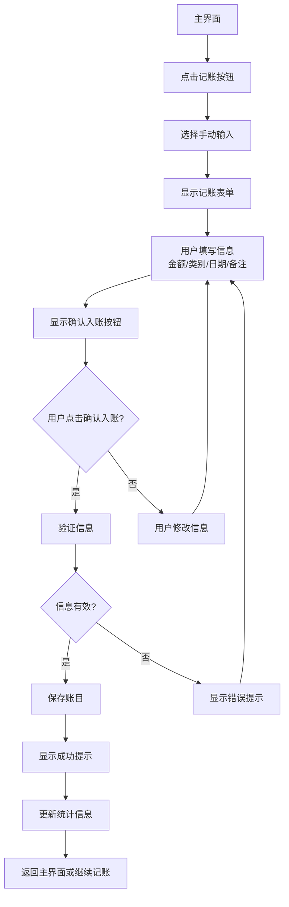
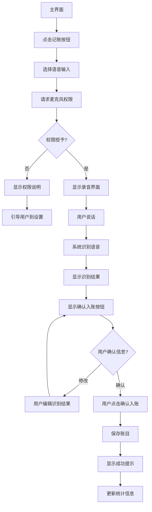
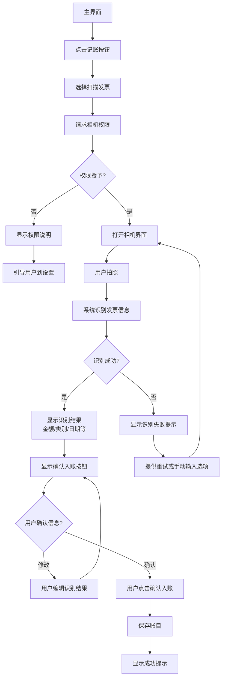
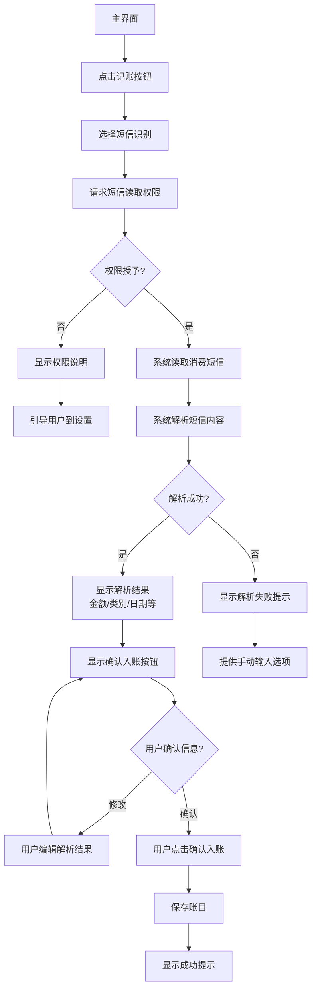
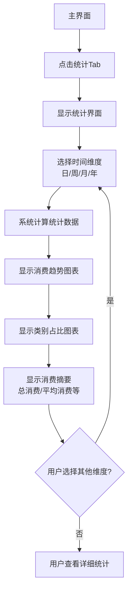
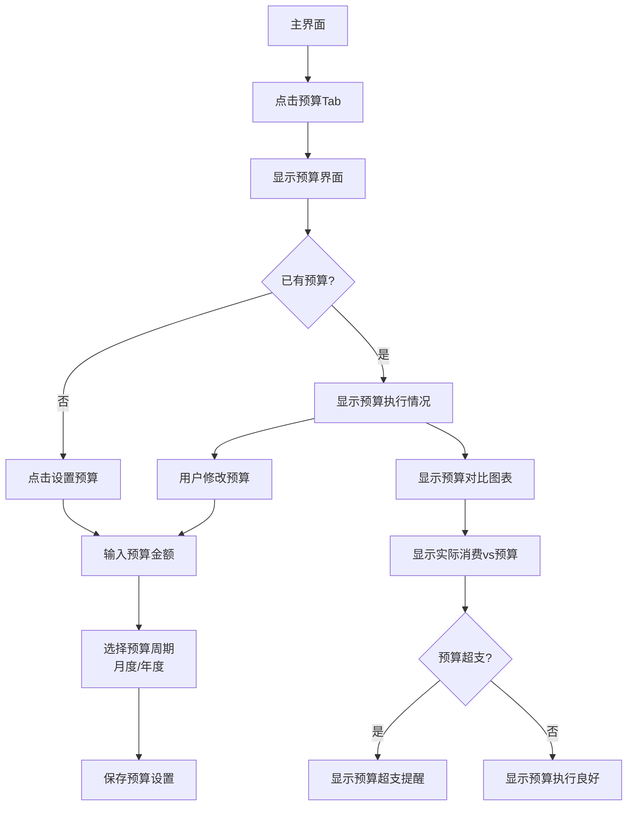
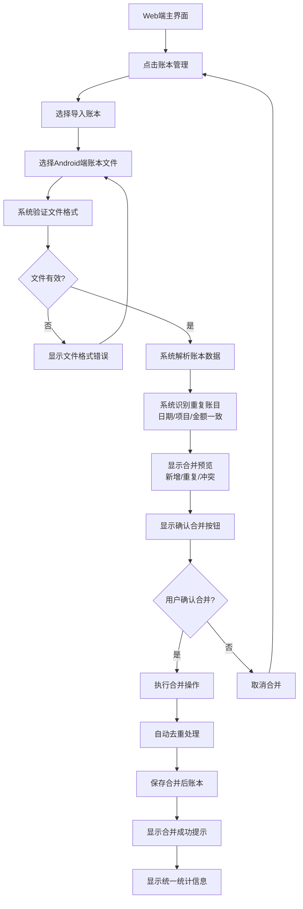

# UX Design Specification GreenPrj

**Author:** Auto
**Date:** 2026-01-26

---

## Executive Summary

### Project Vision

GreenPrj 是一款专注于隐私安全和个人数据主权的跨平台个人记账应用。采用本地优先的数据存储策略，确保用户的财务数据完全掌控在自己手中。通过智能识别技术（发票扫描、短信解析、语音输入）和多端账本合并功能，帮助用户轻松实现"随时记录、随时掌握"的记账体验。

### Target Users

**主要用户：40岁家庭主妇（张女士）**
- 负责家庭日常开支管理
- 关注数据隐私安全
- 希望培养良好的财务管理思维
- 需要多端记账和账本合并功能

**用户群体特征：**
- 有消费记账诉求的个人用户
- 有意培养财务管理思维的用户
- 关注数据隐私安全的用户
- 需要多端记账和账本合并的用户

### Key Design Challenges

1. **隐私安全感知设计**：通过UI设计让用户直观感受到数据安全，建立对本地存储的信任感
2. **智能识别易用性**：发票扫描、短信解析、语音输入等智能功能需要简单易用，降低学习成本
3. **多端一致性体验**：Android和Web平台需要保持一致的交互模式和视觉风格
4. **快速记账流程**：优化记账操作流程，减少步骤，提高记账及时性
5. **数据可视化**：清晰直观地展示消费统计和预算对比，帮助用户理解财务数据

### Design Opportunities

1. **本地存储信任感**：通过UI元素（如"数据仅存储在本地"提示）传达数据安全信息
2. **智能识别体验优化**：简化发票扫描、短信解析流程，提供清晰的确认步骤
3. **统计可视化设计**：设计直观的图表和报表，帮助用户快速理解消费趋势和类别占比
4. **多端协同体验**：设计清晰的账本合并流程，让用户轻松管理多端数据
5. **密码保护体验**：设计友好的密码登录界面，强化数据安全意识

---

## Core User Experience

### Defining Experience

**核心用户行为：快速记账**

用户最频繁的操作是**快速记账**（消费后立即记录）。这是产品的核心价值所在，也是用户每天都会进行的操作。快速记账的成功体验直接影响用户对产品的整体满意度。

**核心体验原则：**
- **快速优先**：记账操作应在3步内完成，减少用户操作成本
- **智能简化**：通过智能识别（发票扫描、短信解析、语音输入）减少手动输入
- **即时反馈**：记账成功后立即显示确认信息，让用户感受到操作完成

### Platform Strategy

**平台支持：**
- **Android移动端**：触摸交互为主，支持相机、麦克风、短信读取等设备能力
- **Web端（Windows）**：鼠标/键盘交互为主，支持详细数据管理和完整报表分析

**平台特性：**
- **离线功能**：支持离线记账（数据本地存储），无需网络连接
- **设备能力利用**：
  - 移动端：相机（发票扫描）、麦克风（语音输入）、短信读取权限（自动识别消费短信）
  - Web端：大屏幕显示（详细统计报表）、键盘输入（快速数据录入）

**多端一致性：**
- Android和Web平台保持一致的交互模式和视觉风格
- 数据格式统一，便于导入导出和账本合并
- 核心功能在两端都能完整使用

### Effortless Interactions

**零思考操作设计：**

1. **快速记账流程**：
   - 打开APP → 点击"记账" → 输入金额和类别 → 完成（3步内完成）
   - 智能识别：扫描发票/读取短信 → 自动识别信息 → 用户确认 → 完成（减少手动输入）

2. **智能识别体验**：
   - 发票扫描：一键拍照 → 自动识别 → 确认信息 → 完成
   - 短信解析：自动读取消费短信 → 解析信息 → 确认入账 → 完成
   - 语音输入：按住说话 → 自动识别 → 确认信息 → 完成

3. **数据安全感知**：
   - 密码登录：简单清晰的登录界面，强化数据安全意识
   - 本地存储提示：通过UI元素（如"数据仅存储在本地"提示）传达数据安全信息

4. **统计查看**：
   - 一键查看：点击"统计" → 立即显示消费趋势和类别占比
   - 清晰可视化：直观的图表和报表，帮助用户快速理解财务数据

### Critical Success Moments

**关键成功时刻：**

1. **第一次成功记账**：
   - 用户快速完成记账操作（3步内）
   - 看到清晰的确认信息，感受到操作成功
   - **体验要求**：操作简单、反馈及时、界面友好

2. **第一次查看统计**：
   - 用户看到清晰的消费趋势图表和类别占比
   - 发现消费规律，感受到产品价值
   - **体验要求**：数据可视化清晰、统计维度丰富、易于理解

3. **第一次使用智能识别**：
   - 发票扫描成功识别消费信息
   - 短信解析自动识别消费信息
   - 语音输入成功识别并转换为文字
   - **体验要求**：识别准确率高、操作简单、确认流程清晰

4. **第一次账本合并**：
   - 成功将手机和PC端的账本合并
   - 看到完整的财务视图，感受到数据统一管理
   - **体验要求**：合并流程简单、去重准确、统计完整

5. **隐私安全感建立**：
   - 意识到数据完全在本地，密码保护
   - 不用担心隐私泄露，建立对产品的信任
   - **体验要求**：安全提示清晰、数据存储透明、用户掌控感强

### Experience Principles

**UX设计指导原则：**

1. **快速优先**：
   - 记账操作应快速完成（3步内）
   - 减少用户操作步骤，提高记账效率
   - 智能识别减少手动输入，降低操作成本

2. **安全可见**：
   - 通过UI设计传达数据安全信息
   - 密码登录界面友好，强化安全意识
   - 本地存储提示清晰，建立用户信任

3. **智能简化**：
   - 智能识别功能简单易用，降低学习成本
   - 自动识别减少手动输入，提高记账及时性
   - 确认流程清晰，避免误操作

4. **多端一致**：
   - Android和Web平台保持一致的交互模式
   - 视觉风格统一，降低用户学习成本
   - 数据格式统一，便于多端协同

5. **数据可视化**：
   - 统计报表清晰直观，帮助用户理解财务数据
   - 图表设计简洁明了，易于理解
   - 多维度统计满足不同用户需求

---

## Desired Emotional Response

### Primary Emotional Goals

**核心情感目标：安全感、轻松感、掌控感、成就感、信任感**

1. **安全感**：
   - 用户感受到数据完全在本地，密码保护，不用担心隐私泄露
   - 对产品数据安全建立信任，放心使用产品记录财务信息
   - 完全掌控自己的财务数据，不受第三方干扰

2. **轻松感**：
   - 快速记账操作简单，3步内完成，不再觉得记账是负担
   - 智能识别减少手动输入，提高记账效率
   - 记账成为轻松愉快的体验，而不是繁琐的任务

3. **掌控感**：
   - 清楚知道钱花在哪里，通过统计了解消费规律
   - 能够合理规划消费额度，控制家庭支出
   - 通过数据统计获得财务洞察，优化消费习惯

4. **成就感**：
   - 成功控制超支，达成财务目标
   - 养成良好记账习惯，持续优化消费行为
   - 通过统计数据发现消费规律，做出更好的财务决策

5. **信任感**：
   - 对产品数据安全信任，放心使用
   - 对智能识别准确性信任，依赖自动识别功能
   - 对统计数据准确性信任，基于数据做出决策

### Emotional Journey Mapping

**情感旅程映射：**

1. **发现阶段 - 好奇与期待**：
   - 听到朋友推荐"数据安全"特点，产生好奇
   - 对隐私安全产生期待，希望找到安全的记账方式

2. **首次使用 - 安心与惊喜**：
   - 设置密码时感受到数据安全的重要性，产生安心感
   - 体验智能识别功能时，感受到惊喜和便利
   - 看到清晰的统计报表时，感受到产品的实用性

3. **日常使用 - 轻松与掌控**：
   - 快速记账时感受到轻松感，不再觉得记账是负担
   - 查看统计时感受到掌控感，清楚了解消费情况
   - 使用智能识别时感受到便利，减少操作成本

4. **价值感知 - 成就感与信任**：
   - 发现消费规律时感受到成就感，获得财务洞察
   - 成功控制超支时感受到成就感，达成财务目标
   - 意识到数据安全时感受到信任感，建立对产品的信任

5. **长期使用 - 习惯与推荐**：
   - 养成记账习惯时感受到轻松感，记账成为日常生活的一部分
   - 推荐他人时感受到成就感，分享产品价值

6. **错误恢复 - 可靠与友好**：
   - 遇到错误时，系统提供清晰的错误提示和恢复路径
   - 感受到产品的可靠性和用户友好性，建立信任

### Micro-Emotions

**关键微情感状态：**

1. **信心 vs. 困惑**：
   - **目标**：用户对产品功能有信心，操作清晰明了
   - **避免**：用户感到困惑，不知道如何使用功能

2. **信任 vs. 怀疑**：
   - **目标**：用户对数据安全信任，放心使用产品
   - **避免**：用户对数据安全产生怀疑，担心隐私泄露

3. **轻松 vs. 焦虑**：
   - **目标**：用户感受到轻松，记账不再是负担
   - **避免**：用户感到焦虑，担心操作复杂或数据丢失

4. **成就感 vs. 挫败感**：
   - **目标**：用户感受到成就感，成功达成财务目标
   - **避免**：用户感到挫败，无法达成预期目标

5. **满意 vs. 失望**：
   - **目标**：用户对产品功能满意，感受到价值
   - **避免**：用户对产品功能失望，无法满足需求

### Design Implications

**情感-设计连接：**

1. **安全感 → UX设计方法**：
   - 密码登录界面友好，强化数据安全意识
   - 通过UI元素（如"数据仅存储在本地"提示）传达数据安全信息
   - 数据加密存储的视觉提示，建立用户信任

2. **轻松感 → UX设计方法**：
   - 快速记账流程简化，3步内完成
   - 智能识别功能简单易用，降低学习成本
   - 界面设计简洁明了，减少认知负担

3. **掌控感 → UX设计方法**：
   - 统计报表清晰直观，帮助用户理解财务数据
   - 多维度统计满足不同用户需求
   - 数据可视化设计简洁明了，易于理解

4. **成就感 → UX设计方法**：
   - 成功完成操作时提供清晰的确认信息
   - 达成财务目标时提供成就提示
   - 发现消费规律时提供洞察提示

5. **信任感 → UX设计方法**：
   - 智能识别准确率高，建立用户信任
   - 统计数据准确可靠，建立用户信任
   - 错误处理友好，建立用户信任

### Emotional Design Principles

**情感设计指导原则：**

1. **安全可见原则**：
   - 通过UI设计传达数据安全信息
   - 密码登录界面友好，强化安全意识
   - 本地存储提示清晰，建立用户信任

2. **轻松简化原则**：
   - 操作流程简化，减少用户操作步骤
   - 智能识别功能简单易用，降低学习成本
   - 界面设计简洁明了，减少认知负担

3. **掌控透明原则**：
   - 数据可视化清晰直观，帮助用户理解财务数据
   - 多维度统计满足不同用户需求
   - 数据展示透明，用户完全掌控

4. **成就反馈原则**：
   - 成功完成操作时提供清晰的确认信息
   - 达成财务目标时提供成就提示
   - 发现消费规律时提供洞察提示

5. **信任可靠原则**：
   - 智能识别准确率高，建立用户信任
   - 统计数据准确可靠，建立用户信任
   - 错误处理友好，建立用户信任

---

## UX Pattern Analysis & Inspiration

### Inspiring Products Analysis

#### 随手记（Suishouji）

**产品定位：**
随手记是一款功能全面的个人记账应用，面向个人消费者和个体经营者，提供专业的记账和理财服务。

**UX设计优势：**

1. **视觉设计**：
   - 采用橙、白、灰三色搭配，视觉层次清晰
   - 新版本使用浅色系配色，整体显得年轻活力
   - 通过调整文字大小和颜色标注系统提升视觉重心层次
   - **可借鉴**：清晰的色彩层次和视觉重心设计

2. **交互优化**：
   - 将"记一笔"按钮从浮动层改为Tab栏主页签，实现页面平滑过渡
   - 虚拟键盘区域进行功能区分，降低误触率
   - 流水采用时间维度收纳处理，消除用户心理压迫感
   - **可借鉴**：核心功能入口放在Tab栏，降低操作成本

3. **用户体验设计**：
   - 净化主功能区，从强调"记账行为"转变为呈现"记账结果"
   - 通过个性化换肤、多套视觉满足身份专属感
   - 增强产品效率，将高频模块重新汇聚在显眼位置
   - **可借鉴**：主界面展示记账结果，而非强调记账行为

**存在的不足：**

1. **界面复杂性**：
   - 模块众多，导航标签达6个，需返回首页才能切换功能
   - 功能入口分散，存在冗余感和"走迷宫"现象
   - 对新手用户学习成本较高
   - **避免**：简化导航结构，减少功能入口，降低学习成本

2. **商业化设计问题**：
   - 导流模块嵌入各处，对用户体验有一定影响
   - **避免**：保持界面简洁，避免过度商业化

#### 薄荷记账（Bohe）

**产品定位：**
薄荷记账是一款功能性与简洁性兼顾的个人记账应用，无广告，注重用户体验。

**UX设计特点（基于市场分析）：**

1. **简洁性**：
   - 功能性与简洁性兼顾
   - 无开屏和内部广告
   - **可借鉴**：保持界面简洁，避免广告干扰

2. **功能完整性**：
   - 支持多账户、分类账本、多人在线账本
   - 边记边算功能完善（支持加减乘除和括号运算）
   - 预算、标签和查询功能完整
   - **可借鉴**：功能完整但不复杂，保持易用性

**存在的不足：**

1. **UI美观度**：
   - UI和美观度不足
   - **改进**：提升UI设计美观度，增强视觉吸引力

2. **操作便捷性**：
   - 分类记账缺少快捷图标，操作较繁琐
   - **改进**：增加快捷操作，提高记账效率

### Transferable UX Patterns

**可借鉴的UX模式：**

1. **导航模式**：
   - **Tab栏导航**：将核心功能（如"记账"）放在Tab栏，降低操作成本
   - **简化导航结构**：避免过多导航标签，保持界面简洁
   - **应用场景**：GreenPrj的核心功能（记账、统计、预算）可放在Tab栏

2. **交互模式**：
   - **核心功能突出**：将"记账"功能放在显眼位置，降低操作成本
   - **虚拟键盘优化**：虚拟键盘区域进行功能区分，降低误触率
   - **应用场景**：GreenPrj的快速记账功能应放在主界面显眼位置

3. **视觉模式**：
   - **色彩层次**：清晰的色彩层次和视觉重心设计
   - **浅色系配色**：使用浅色系配色，整体显得年轻活力
   - **应用场景**：GreenPrj的界面设计应采用清晰的色彩层次

4. **信息架构**：
   - **结果导向**：主界面展示记账结果，而非强调记账行为
   - **时间维度收纳**：流水采用时间维度收纳处理，消除用户心理压迫感
   - **应用场景**：GreenPrj的主界面应展示消费统计，而非强调记账操作

5. **功能设计**：
   - **功能完整但不复杂**：功能完整但保持易用性
   - **快捷操作**：增加快捷操作，提高记账效率
   - **应用场景**：GreenPrj应保持功能完整，但通过智能识别减少操作步骤

### Patterns to Avoid

**需要避免的模式：**

1. **界面复杂性**：
   - 避免过多导航标签和功能入口
   - 避免功能入口分散，造成"走迷宫"现象
   - **GreenPrj策略**：简化导航结构，核心功能放在Tab栏

2. **商业化干扰**：
   - 避免导流模块嵌入各处，影响用户体验
   - 避免广告干扰用户操作
   - **GreenPrj策略**：保持界面简洁，暂不考虑盈利，专注用户体验

3. **操作繁琐**：
   - 避免分类记账缺少快捷图标，操作较繁琐
   - 避免需要多次点击才能完成记账
   - **GreenPrj策略**：通过智能识别减少手动输入，提高记账效率

### Design Opportunities

**设计机会：**

1. **隐私安全感知**：
   - 随手记和薄荷记账都依赖云端同步，存在隐私风险
   - **GreenPrj机会**：通过UI设计传达数据本地存储的安全感，建立用户信任

2. **智能识别体验**：
   - 现有记账APP主要依赖手动输入
   - **GreenPrj机会**：通过发票扫描、短信解析、语音输入等智能识别，降低操作成本

3. **多端账本合并**：
   - 现有记账APP在多端数据合并方面存在不足
   - **GreenPrj机会**：设计清晰的账本合并流程，解决多端数据割裂问题

4. **简洁性优化**：
   - 随手记界面复杂，薄荷记账UI美观度不足
   - **GreenPrj机会**：在保持功能完整的同时，提升界面简洁性和美观度

### UX Design Principles from Inspiration

**从灵感中提取的UX设计原则：**

1. **简洁优先**：
   - 保持界面简洁，避免功能入口分散
   - 核心功能放在显眼位置，降低操作成本

2. **结果导向**：
   - 主界面展示记账结果，而非强调记账行为
   - 通过统计报表展示消费趋势，帮助用户理解财务数据

3. **智能简化**：
   - 通过智能识别减少手动输入，提高记账效率
   - 快捷操作提高用户体验

4. **视觉清晰**：
   - 清晰的色彩层次和视觉重心设计
   - 使用浅色系配色，整体显得年轻活力

5. **隐私安全**：
   - 通过UI设计传达数据安全信息
   - 建立用户对数据安全的信任

---

## Design System Choice

### Design System Selection

**选择的设计系统：Material Design**

**选择理由：**
- Material Design是Google推出的设计系统，广泛应用于Android平台
- 提供完整的组件库和设计规范，支持跨平台一致性
- 支持Web平台（Material Design for Web），便于实现Android和Web的统一体验
- 有丰富的文档和社区支持，便于开发和维护

### Material Design应用

**Android平台：**
- 使用Material Design 3（Material You）设计规范
- 采用Material Components组件库
- 遵循Material Design的交互模式和视觉规范

**Web平台：**
- 使用Material Design for Web
- 采用Material Components for Web组件库
- 保持与Android平台的视觉一致性

### UI风格要求（基于frontend-design技能）

**设计原则：**
- **独特性**：避免通用的AI生成美学，创建有特色的界面
- **生产级质量**：实现功能完整、视觉精美的代码
- **创意选择**：做出意想不到的设计选择，避免千篇一律

**视觉设计指导：**

1. **字体选择**：
   - 选择独特、有趣的字体，避免通用字体（如Arial、Inter）
   - 使用有特色的显示字体配合精致的正文字体
   - 字体选择要有特色，提升界面美学

2. **色彩与主题**：
   - 采用Material Design的色彩系统
   - 使用CSS变量保持一致性
   - 主导色配合鲜明的强调色，避免平均分配的色彩方案
   - 支持浅色和深色主题

3. **动效与交互**：
   - 使用Material Design的动效规范
   - 优先使用CSS动画实现效果
   - 关注高影响力的时刻：页面加载、交互动画
   - 使用滚动触发和悬停状态创造惊喜

4. **空间布局**：
   - 采用Material Design的布局系统
   - 使用网格系统和间距规范
   - 保持清晰的视觉层次

5. **视觉细节**：
   - 创建有深度的背景和视觉效果
   - 使用渐变、阴影、透明度等效果
   - 添加符合整体美学的纹理和细节

**避免的设计：**
- 避免过度使用的字体（Inter、Roboto、Arial、系统字体）
- 避免陈词滥调的色彩方案（特别是紫色渐变白底）
- 避免可预测的布局和组件模式
- 避免缺乏上下文特色的模板化设计

**实现要求：**
- 生产级代码，功能完整
- 视觉突出且令人难忘
- 具有清晰的美学观点
- 每个细节都经过精心打磨

### Design System Components

**核心组件：**
- Material Design按钮、输入框、卡片、导航等组件
- 自定义组件基于Material Design规范扩展
- 保持组件的一致性和可复用性

**主题定制：**
- 基于Material Design主题系统
- 支持品牌色彩定制
- 支持浅色/深色主题切换

---

## 2. Core User Experience

### 2.1 Defining Experience

**核心交互：快速记账（点击入账）**

GreenPrj的核心交互是"快速记账"，用户通过点击"确认入账"按钮完成记账操作。无论用户使用手动输入、语音输入还是扫描输入，都需要用户点击"确认入账"按钮来确认和完成记账。

**核心交互描述：**
- **用户描述**："点击入账，不论手动输入、语音输入、扫描输入，均需用户点击'确认入账'"
- **核心价值**：快速、简单、可控的记账体验
- **差异化**：统一的确认流程，确保用户对每笔账目都有控制权

### 2.2 User Mental Model

**用户当前解决方案：**

1. **手动记账方式**：
   - 使用纸笔记录
   - 使用Excel表格
   - 使用其他记账APP（手动输入）

2. **用户期望**：
   - 记账操作应该简单快速
   - 记账结果应该立即可见
   - 记账过程应该可控（确认后再入账）

3. **用户困惑点**：
   - 担心自动识别错误，需要确认
   - 担心误操作，需要撤销机制
   - 需要清晰的反馈，知道操作是否成功

**用户心智模型：**
- 记账是一个"输入-确认-完成"的过程
- 用户希望控制每一步操作
- 用户期望快速完成，但也要确保准确性

### 2.3 Success Criteria

**核心体验成功标准：**

1. **操作简单性**：
   - 用户能够在3步内完成记账（选择输入方式 → 输入/识别信息 → 确认入账）
   - 操作流程清晰，无需学习成本

2. **反馈及时性**：
   - 点击"确认入账"后立即显示成功反馈
   - 账目立即出现在账本列表中
   - 统计信息实时更新

3. **控制感**：
   - 用户可以在确认前修改信息
   - 用户可以在确认后撤销操作
   - 用户完全掌控记账过程

4. **准确性**：
   - 智能识别信息准确（发票扫描、短信解析、语音输入）
   - 用户确认机制确保数据准确性
   - 支持修改和更正

**成功指标：**
- 用户能够在3步内完成记账
- 用户对智能识别准确性满意
- 用户对确认流程感到安心
- 记账操作成功率>95%

### 2.4 Novel UX Patterns

**模式分析：**

1. **确认入账模式**：
   - **模式类型**：创新模式（在记账APP中统一确认流程）
   - **创新点**：无论输入方式，统一使用"确认入账"按钮
   - **用户教育**：通过清晰的UI提示和引导，让用户理解确认流程
   - **熟悉隐喻**：类似"提交"按钮，用户容易理解

2. **智能识别确认模式**：
   - **模式类型**：组合模式（智能识别 + 用户确认）
   - **创新点**：智能识别减少输入，用户确认确保准确
   - **用户教育**：首次使用时提供引导，展示识别结果和确认流程
   - **熟悉隐喻**：类似"预览-确认"模式

3. **多输入方式统一流程**：
   - **模式类型**：创新模式（多种输入方式，统一确认流程）
   - **创新点**：手动输入、语音输入、扫描输入都使用相同的确认流程
   - **用户教育**：通过一致的UI设计，让用户理解统一流程
   - **熟悉隐喻**：类似"表单提交"模式

### 2.5 Experience Mechanics

**核心体验机制设计：**

#### 1. Initiation（启动）

**如何开始记账：**
- **主界面入口**：主界面显眼的"记账"按钮（Tab栏或浮动按钮）
- **触发方式**：点击"记账"按钮
- **输入方式选择**：显示输入方式选择（手动输入、语音输入、扫描输入）

**用户引导：**
- 首次使用时提供引导，说明不同输入方式
- 主界面显示快速记账提示

#### 2. Interaction（交互）

**用户操作流程：**

**方式A：手动输入**
1. 用户点击"记账"按钮
2. 显示记账表单（金额、类别、日期、备注等）
3. 用户填写信息
4. 显示"确认入账"按钮
5. 用户点击"确认入账"

**方式B：语音输入**
1. 用户点击"记账"按钮
2. 选择"语音输入"
3. 用户说话，系统识别并转换为文字
4. 显示识别结果和"确认入账"按钮
5. 用户确认信息后点击"确认入账"

**方式C：扫描输入（发票/账单）**
1. 用户点击"记账"按钮
2. 选择"扫描发票"
3. 用户拍照，系统识别发票信息
4. 显示识别结果和"确认入账"按钮
5. 用户确认信息后点击"确认入账"

**方式D：短信解析**
1. 用户点击"记账"按钮
2. 选择"短信识别"
3. 系统自动读取并解析消费短信
4. 显示识别结果和"确认入账"按钮
5. 用户确认信息后点击"确认入账"

**系统响应：**
- 实时显示识别结果
- 支持用户修改识别结果
- 提供清晰的"确认入账"按钮

#### 3. Feedback（反馈）

**操作反馈：**

1. **识别过程反馈**：
   - 语音输入：显示"正在识别..."
   - 扫描输入：显示"正在识别..."
   - 短信解析：显示"正在解析..."

2. **识别结果反馈**：
   - 显示识别结果（金额、类别、日期等）
   - 高亮显示识别信息
   - 支持用户修改识别结果

3. **确认反馈**：
   - 点击"确认入账"后显示成功提示
   - 账目立即出现在账本列表中
   - 统计信息实时更新

4. **错误反馈**：
   - 识别失败时显示错误提示
   - 提供重试选项
   - 提供手动输入备选方案

#### 4. Completion（完成）

**完成状态：**

1. **成功完成**：
   - 显示"记账成功"提示
   - 账目出现在账本列表中
   - 统计信息更新
   - 返回主界面或继续记账

2. **撤销机制**：
   - 支持撤销最近一次记账
   - 提供"撤销"按钮（3秒内可撤销）
   - 撤销后账目从列表中移除

3. **下一步操作**：
   - 继续记账（快速连续记账）
   - 查看统计（查看消费统计）
   - 返回主界面

**体验优化：**
- 支持快速连续记账（记账成功后可直接继续记账）
- 提供"继续记账"快捷按钮
- 记账成功后显示统计摘要（今日消费、本月消费等）

---

## Visual Foundation

### Color System

**Material Design默认主题色彩：**

1. **主色调（Primary Color）**：
   - 使用Material Design默认蓝色主题（#2196F3）
   - 主色调用于主要操作按钮、导航栏、强调元素
   - 主色调变体用于悬停和激活状态

2. **强调色（Accent Color）**：
   - 使用Material Design默认强调色（#FF9800）
   - 强调色用于重要操作、警告提示、关键信息

3. **背景色（Background Colors）**：
   - 浅色主题：白色背景（#FFFFFF）
   - 深色主题：深灰色背景（#121212）
   - 卡片背景：浅灰色（#F5F5F5）或深色卡片背景

4. **文字颜色（Text Colors）**：
   - 主要文字：深灰色（#212121）或浅色文字（#FFFFFF）
   - 次要文字：中灰色（#757575）或浅灰色（#BDBDBD）
   - 禁用文字：浅灰色（#E0E0E0）

5. **状态颜色（Status Colors）**：
   - 成功：绿色（#4CAF50）
   - 警告：橙色（#FF9800）
   - 错误：红色（#F44336）
   - 信息：蓝色（#2196F3）

### Typography System

**Material Design默认字体系统：**

1. **字体选择**：
   - 使用Material Design默认字体：Roboto
   - Android：系统Roboto字体
   - Web：Google Fonts Roboto字体

2. **字体大小层级**：
   - **H1（大标题）**：24sp/px，粗体
   - **H2（中标题）**：20sp/px，粗体
   - **H3（小标题）**：16sp/px，粗体
   - **Body 1（正文）**：16sp/px，常规
   - **Body 2（正文小）**：14sp/px，常规
   - **Caption（说明文字）**：12sp/px，常规
   - **Button（按钮文字）**：14sp/px，粗体

3. **字体应用**：
   - 标题使用粗体，增强视觉层次
   - 正文使用常规字体，提高可读性
   - 说明文字使用较小字号，提供辅助信息

### Spacing System

**Material Design默认间距系统：**

1. **基础间距单位**：
   - 使用8dp/sp作为基础间距单位
   - 所有间距都是8的倍数（8, 16, 24, 32, 40, 48等）

2. **组件间距**：
   - 组件内部间距：8dp/sp
   - 组件之间间距：16dp/sp
   - 页面边距：16dp/sp或24dp/sp

3. **布局间距**：
   - 卡片内边距：16dp/sp
   - 列表项间距：8dp/sp或16dp/sp
   - 表单字段间距：16dp/sp

### Visual Style

**整体视觉风格：**

1. **设计风格**：
   - 简洁现代：遵循Material Design设计语言
   - 专业可靠：适合财务应用的专业感
   - 清晰直观：信息层次清晰，易于理解

2. **图标风格**：
   - 使用Material Design图标系统（Material Icons）
   - 图标风格统一，线条简洁
   - 图标大小：24dp/sp（标准）、48dp/sp（大图标）

3. **阴影和圆角**：
   - 卡片阴影：Material Design默认阴影（Elevation）
   - 按钮圆角：4dp/sp（小圆角）或8dp/sp（大圆角）
   - 卡片圆角：8dp/sp或12dp/sp

4. **动效**：
   - 使用Material Design动效规范
   - 过渡动画：200ms-300ms
   - 交互反馈：Ripple效果、Elevation变化

### Theme Customization

**主题定制（基于Material Design默认主题）：**

1. **浅色主题（Light Theme）**：
   - 默认使用浅色主题
   - 背景：白色（#FFFFFF）
   - 文字：深灰色（#212121）
   - 卡片：浅灰色背景（#F5F5F5）

2. **深色主题（Dark Theme）**：
   - 支持深色主题（未来功能）
   - 背景：深灰色（#121212）
   - 文字：浅色（#FFFFFF）
   - 卡片：深色卡片背景

3. **品牌色定制**：
   - 基于Material Design默认蓝色主题
   - 可根据品牌需求调整主色调
   - 保持Material Design色彩系统一致性

### Visual Design Principles

**视觉设计原则：**

1. **一致性**：
   - Android和Web平台保持视觉一致性
   - 使用统一的色彩、字体、间距系统
   - 遵循Material Design设计规范

2. **清晰性**：
   - 信息层次清晰，重要信息突出
   - 使用色彩、字体、间距建立视觉层次
   - 避免视觉噪音，保持界面简洁

3. **可访问性**：
   - 文字对比度符合WCAG标准
   - 支持不同屏幕尺寸
   - 考虑色盲用户需求

4. **专业性**：
   - 适合财务应用的专业感
   - 传达数据安全和可靠性
   - 避免过于花哨的设计

---

## Design Direction Decision

### Design Directions Explored

**Material Design标准布局模式：**

基于Material Design设计系统和frontend-design技能要求，采用Material Design的标准布局模式，确保界面简洁、现代、专业，同时避免通用的AI生成美学。

**设计方向特点：**
- 使用Material Design标准组件和布局模式
- 保持界面简洁清晰，信息层次分明
- 传达专业可靠的产品形象
- 支持快速记账的核心交互

### Chosen Direction

**选择的设计方向：Material Design标准布局模式**

**布局结构：**

1. **主界面布局**：
   - **Android**：底部Tab导航（记账、统计、预算、设置）
   - **Web**：顶部导航栏 + 侧边栏（记账、统计、预算、设置）
   - 主界面展示记账结果（今日消费、本月消费等）

2. **记账界面布局**：
   - 输入方式选择（手动输入、语音输入、扫描输入、短信识别）
   - 信息输入/识别区域
   - 识别结果展示区域
   - "确认入账"按钮（统一确认流程）

3. **统计界面布局**：
   - 时间维度选择（日/周/月/年）
   - 统计图表展示区域
   - 类别占比展示区域
   - 消费趋势图表

4. **预算界面布局**：
   - 预算设置区域
   - 预算执行情况展示
   - 预算对比图表

### Design Rationale

**选择Material Design标准布局的理由：**

1. **一致性**：
   - Material Design是Android平台的标准设计系统
   - 用户对Material Design布局模式熟悉，降低学习成本
   - Android和Web平台可以保持一致的视觉风格

2. **专业性**：
   - Material Design提供专业可靠的设计语言
   - 适合财务应用的专业感要求
   - 传达数据安全和可靠性

3. **易用性**：
   - 标准布局模式用户熟悉，无需学习
   - 清晰的导航结构，功能入口明确
   - 支持快速记账的核心交互

4. **可维护性**：
   - Material Design有完整的组件库和文档
   - 便于开发和维护
   - 支持跨平台一致性

### Implementation Approach

**实现方法：**

1. **Android平台**：
   - 使用Material Design 3（Material You）组件库
   - 底部Tab导航（记账、统计、预算、设置）
   - Material Components组件（按钮、输入框、卡片等）

2. **Web平台**：
   - 使用Material Design for Web组件库
   - 顶部导航栏 + 侧边栏布局
   - Material Components for Web组件

3. **视觉风格**：
   - 使用Material Design默认主题色彩
   - 使用Roboto字体系统
   - 使用Material Design间距系统
   - 保持简洁现代的设计风格

4. **交互模式**：
   - 遵循Material Design交互规范
   - 使用Material Design动效
   - 统一的"确认入账"按钮设计

---

## User Journey Flows

### Quick Accounting Flow (Manual Input)

**流程描述：**
用户通过手动输入方式完成记账，统一使用"确认入账"按钮确认。

**流程步骤：**

**关键决策点：**
- 信息验证：确保金额、日期等必填信息完整
- 确认入账：用户必须点击"确认入账"按钮才能完成记账
- 错误处理：信息无效时显示错误提示，允许用户修改

### Quick Accounting Flow (Voice Input)

**流程描述：**
用户通过语音输入方式完成记账，系统识别后用户确认入账。

**流程步骤：**

**关键决策点：**
- 权限处理：首次使用需要请求麦克风权限
- 识别结果确认：用户必须确认识别结果后才能入账
- 错误处理：识别失败时提供重试或手动输入选项

### Quick Accounting Flow (Invoice Scan)

**流程描述：**
用户通过扫描发票完成记账，系统识别后用户确认入账。

**流程步骤：**

**关键决策点：**
- 权限处理：首次使用需要请求相机权限
- 识别准确性：识别失败时提供重试或手动输入备选方案
- 信息确认：用户必须确认识别结果后才能入账

### Quick Accounting Flow (SMS Parsing)

**流程描述：**
用户通过短信识别完成记账，系统自动解析后用户确认入账。

**流程步骤：**

**关键决策点：**
- 权限处理：首次使用需要请求短信读取权限
- 自动解析：系统自动读取和解析消费短信
- 信息确认：用户必须确认解析结果后才能入账

### Statistics Viewing Flow

**流程描述：**
用户查看消费统计，包括时间维度和类别维度统计。

**流程步骤：**

**关键决策点：**
- 时间维度选择：用户可以选择不同的时间维度查看统计
- 实时计算：统计数据实时计算和更新
- 可视化展示：使用图表清晰展示消费趋势和类别占比

### Budget Management Flow

**流程描述：**
用户设置和管理预算，查看预算执行情况。

**流程步骤：**

**关键决策点：**
- 预算设置：用户可以设置月度或年度预算
- 预算对比：实时显示实际消费与预算的对比
- 预算提醒：预算超支时显示提醒

### Account Book Merge Flow

**流程描述：**
用户将Android端和Web端的账本合并，系统自动去重。

**流程步骤：**

**关键决策点：**
- 文件验证：导入前验证文件格式和数据完整性
- 重复识别：自动识别重复账目（日期、项目、金额一致）
- 合并确认：用户确认合并预览后才能执行合并
- 冲突处理：合并冲突时提供解决方案

### Journey Patterns

**跨流程的通用模式：**

1. **统一确认模式**：
   - 所有记账方式都使用"确认入账"按钮
   - 确认前用户可以修改信息
   - 确认后显示成功反馈

2. **权限请求模式**：
   - 首次使用时请求权限
   - 权限被拒绝时提供说明和引导
   - 权限授予后正常使用功能

3. **错误恢复模式**：
   - 识别失败时提供重试选项
   - 提供手动输入备选方案
   - 显示清晰的错误提示

4. **反馈模式**：
   - 操作过程中显示进度提示
   - 操作成功后显示成功提示
   - 操作失败时显示错误提示和恢复路径

### Flow Optimization Principles

**流程优化原则：**

1. **最小步骤原则**：
   - 记账操作3步内完成
   - 减少不必要的确认步骤
   - 提供快捷操作

2. **清晰反馈原则**：
   - 每个步骤都有明确的反馈
   - 操作状态清晰可见
   - 错误信息明确易懂

3. **错误恢复原则**：
   - 所有错误都有恢复路径
   - 提供重试和备选方案
   - 支持操作撤销

4. **一致性原则**：
   - 所有输入方式使用统一的确认流程
   - 保持界面和交互的一致性
   - 遵循Material Design规范

---

## Component Strategy

### Design System Components

**Material Design标准组件（可直接使用）：**

1. **基础组件**：
   - **Button（按钮）**：用于主要操作按钮，如"确认入账"、"保存"等
   - **TextField（输入框）**：用于手动输入金额、备注等信息
   - **Card（卡片）**：用于展示账目列表、统计卡片等
   - **Chip（标签）**：用于类别选择、标签显示等
   - **Dialog（对话框）**：用于确认操作、错误提示等
   - **Bottom Navigation（底部导航）**：Android平台主界面导航
   - **App Bar（顶部栏）**：Web平台顶部导航栏
   - **Drawer（侧边栏）**：Web平台侧边导航栏

2. **数据展示组件**：
   - **List（列表）**：用于账目列表展示
   - **Data Table（数据表）**：用于Web平台详细数据展示
   - **Progress Indicator（进度指示器）**：用于识别过程、加载状态等

3. **选择组件**：
   - **Radio Button（单选按钮）**：用于单选操作
   - **Checkbox（复选框）**：用于多选操作
   - **Switch（开关）**：用于开关设置
   - **Date Picker（日期选择器）**：用于选择日期

4. **反馈组件**：
   - **Snackbar（提示条）**：用于操作成功/失败提示
   - **Alert Dialog（警告对话框）**：用于重要提示和确认
   - **Progress Bar（进度条）**：用于加载进度显示

### Custom Components

**需要自定义的组件：**

#### 1. Confirm Entry Button（确认入账按钮）

**Purpose：** 统一的确认入账按钮，所有输入方式都使用此按钮完成记账

**Usage：** 
- 手动输入、语音输入、扫描输入、短信识别后显示
- 用户确认信息后点击完成记账

**Anatomy：**
- 按钮文字："确认入账"
- 按钮图标：Material Icons "check" 图标
- 按钮样式：Material Design Primary Button样式

**States：**
- Default：正常状态，可点击
- Hover：悬停状态（Web平台）
- Active：点击状态
- Disabled：禁用状态（信息不完整时）
- Loading：处理中状态（保存账目时）

**Variants：**
- 标准尺寸：用于记账界面
- 浮动按钮（FAB）：用于快速记账入口（可选）

**Accessibility：**
- ARIA label: "确认入账"
- 键盘支持：Enter键触发
- 焦点指示：清晰的焦点状态

**Content Guidelines：**
- 按钮文字清晰明确："确认入账"
- 按钮位置：信息输入区域下方，显眼位置

**Interaction Behavior：**
- 点击后验证信息完整性
- 信息完整时启用按钮，不完整时禁用
- 点击后显示加载状态，保存成功后显示成功提示

#### 2. Statistics Chart Component（统计图表组件）

**Purpose：** 展示消费趋势和类别占比的图表组件

**Usage：**
- 统计界面展示消费趋势图表
- 统计界面展示类别占比图表

**Anatomy：**
- 图表标题
- 图表内容（折线图、饼图、柱状图等）
- 图例说明
- 数据标签

**States：**
- Default：正常显示
- Loading：数据加载中
- Empty：无数据状态
- Error：数据加载失败

**Variants：**
- 消费趋势图表（折线图）：展示时间维度消费趋势
- 类别占比图表（饼图/柱状图）：展示类别维度消费占比
- 预算对比图表（柱状图）：展示预算vs实际消费对比

**Accessibility：**
- 图表数据可访问（屏幕阅读器支持）
- 图表颜色符合色盲用户需求
- 提供数据表格备选方案

**Content Guidelines：**
- 图表标题清晰描述数据内容
- 数据标签清晰易读
- 图例说明清楚

**Interaction Behavior：**
- 支持图表交互（悬停显示详细数据）
- 支持图表缩放（Web平台）
- 支持数据导出

#### 3. Budget Comparison Component（预算对比组件）

**Purpose：** 展示预算执行情况和预算对比

**Usage：**
- 预算界面展示预算执行情况
- 预算界面展示预算vs实际消费对比

**Anatomy：**
- 预算设置信息（预算金额、预算周期）
- 实际消费信息（实际消费金额、剩余预算）
- 预算对比图表
- 预算执行状态（正常/超支）

**States：**
- Default：正常显示
- Budget Exceeded：预算超支状态（高亮显示）
- Budget Normal：预算正常状态

**Variants：**
- 月度预算对比
- 年度预算对比

**Accessibility：**
- 预算信息可访问（屏幕阅读器支持）
- 预算状态清晰可见（颜色+文字）

**Content Guidelines：**
- 预算信息清晰展示
- 预算执行状态明确
- 预算对比图表直观

**Interaction Behavior：**
- 支持预算设置修改
- 支持预算执行详情查看
- 预算超支时显示提醒

#### 4. Account Book Merge Component（账本合并组件）

**Purpose：** 处理账本合并流程，包括导入、去重、合并确认

**Usage：**
- 账本管理界面导入账本
- 账本合并预览和确认

**Anatomy：**
- 文件选择区域
- 合并预览区域（新增/重复/冲突账目）
- 合并确认按钮
- 合并结果展示

**States：**
- Default：初始状态
- File Selected：文件已选择
- Parsing：解析中
- Preview：合并预览
- Merging：合并中
- Success：合并成功
- Error：合并失败

**Variants：**
- Android端导入Web端账本
- Web端导入Android端账本

**Accessibility：**
- 文件选择可访问
- 合并预览信息清晰
- 操作按钮可访问

**Content Guidelines：**
- 合并预览信息详细清晰
- 重复账目标识明确
- 合并结果统计完整

**Interaction Behavior：**
- 支持文件拖拽上传（Web平台）
- 支持文件选择（Android平台）
- 合并前显示预览，用户确认后执行
- 合并后显示结果统计

#### 5. Smart Recognition Result Component（智能识别结果组件）

**Purpose：** 展示智能识别结果，支持用户确认和修改

**Usage：**
- 发票扫描识别结果展示
- 短信解析结果展示
- 语音输入识别结果展示

**Anatomy：**
- 识别结果展示区域（金额、类别、日期、备注等）
- 识别置信度指示（可选）
- 编辑按钮
- 确认入账按钮

**States：**
- Recognizing：识别中
- Result Displayed：结果已显示
- Editing：编辑中
- Confirmed：已确认

**Variants：**
- 发票扫描结果
- 短信解析结果
- 语音输入结果

**Accessibility：**
- 识别结果可访问（屏幕阅读器支持）
- 编辑功能可访问
- 确认按钮可访问

**Content Guidelines：**
- 识别结果清晰展示
- 识别信息高亮显示
- 支持用户修改识别结果

**Interaction Behavior：**
- 识别结果可编辑
- 识别结果可确认
- 识别失败时提供重试选项

### Component Implementation Strategy

**组件实现策略：**

1. **基础组件使用Material Components**：
   - Android：Material Components for Android
   - Web：Material Components for Web
   - 保持组件一致性和可复用性

2. **自定义组件基于Material Design规范**：
   - 使用Material Design设计令牌（颜色、字体、间距）
   - 遵循Material Design交互规范
   - 保持视觉风格一致性

3. **组件开发优先级**：
   - **P0（核心组件）**：确认入账按钮、智能识别结果组件
   - **P1（重要组件）**：统计图表组件、预算对比组件
   - **P2（支持组件）**：账本合并组件

4. **组件复用性**：
   - 设计可复用的组件模式
   - 支持组件组合和扩展
   - 保持组件接口一致性

### Implementation Roadmap

**组件实现路线图：**

**Phase 1 - Core Components（MVP核心组件）：**

1. **确认入账按钮**：
   - 优先级：P0
   - 用途：所有记账流程的核心确认组件
   - 实现：基于Material Button扩展

2. **智能识别结果组件**：
   - 优先级：P0
   - 用途：展示识别结果，支持确认和修改
   - 实现：基于Material Card扩展

3. **基础统计图表组件**：
   - 优先级：P1
   - 用途：展示消费统计和趋势
   - 实现：使用图表库（如Chart.js、MPAndroidChart）

**Phase 2 - Supporting Components（支持组件）：**

1. **预算对比组件**：
   - 优先级：P1
   - 用途：展示预算执行情况
   - 实现：基于Material Card和图表组件组合

2. **账本合并组件**：
   - 优先级：P1
   - 用途：处理账本合并流程
   - 实现：基于Material Dialog和List组件组合

**Phase 3 - Enhancement Components（增强组件）：**

1. **高级统计图表组件**：
   - 优先级：P2
   - 用途：增强统计功能
   - 实现：扩展图表组件功能

2. **数据可视化组件**：
   - 优先级：P2
   - 用途：增强数据展示
   - 实现：基于Material Design规范扩展

---

## UX Consistency Patterns

### Button Hierarchy

**按钮层级模式：**

1. **主要操作按钮（Primary Button）**：
   - **使用场景**：核心操作，如"确认入账"按钮
   - **视觉设计**：Material Design Primary Button样式，主色调背景
   - **行为**：点击后执行主要操作，显示加载状态
   - **可访问性**：清晰的ARIA标签，键盘支持（Enter键）
   - **移动端考虑**：触摸目标至少48dp/sp

2. **次要操作按钮（Secondary Button）**：
   - **使用场景**：次要操作，如"取消"、"返回"按钮
   - **视觉设计**：Material Design Outlined Button样式
   - **行为**：点击后执行次要操作或取消操作
   - **可访问性**：清晰的ARIA标签，键盘支持

3. **文本按钮（Text Button）**：
   - **使用场景**：辅助操作，如"编辑"、"删除"按钮
   - **视觉设计**：Material Design Text Button样式
   - **行为**：点击后执行辅助操作
   - **可访问性**：清晰的ARIA标签，键盘支持

### Feedback Patterns

**反馈模式：**

1. **成功反馈（Success Feedback）**：
   - **使用场景**：操作成功时，如记账成功、合并成功
   - **视觉设计**：Snackbar显示成功提示，绿色图标
   - **行为**：自动消失（3-5秒）或用户手动关闭
   - **可访问性**：屏幕阅读器播报成功信息
   - **移动端考虑**：Snackbar位置不遮挡重要内容

2. **错误反馈（Error Feedback）**：
   - **使用场景**：操作失败时，如识别失败、合并失败
   - **视觉设计**：Snackbar或Alert Dialog显示错误提示，红色图标
   - **行为**：显示错误信息和恢复选项，用户确认后关闭
   - **可访问性**：屏幕阅读器播报错误信息
   - **移动端考虑**：错误信息清晰，提供恢复路径

3. **警告反馈（Warning Feedback）**：
   - **使用场景**：需要用户注意时，如预算超支提醒
   - **视觉设计**：Snackbar或Alert显示警告，橙色图标
   - **行为**：显示警告信息，用户确认后关闭
   - **可访问性**：屏幕阅读器播报警告信息

4. **信息反馈（Info Feedback）**：
   - **使用场景**：提供信息时，如操作提示、功能说明
   - **视觉设计**：Snackbar显示信息提示，蓝色图标
   - **行为**：自动消失或用户手动关闭
   - **可访问性**：屏幕阅读器播报信息

### Form Patterns

**表单模式：**

1. **表单验证模式**：
   - **使用场景**：用户输入信息时，如记账表单、预算设置表单
   - **视觉设计**：实时验证，错误字段高亮显示
   - **行为**：输入时实时验证，错误时显示错误提示
   - **可访问性**：错误信息可访问，键盘导航支持
   - **移动端考虑**：错误提示清晰，不遮挡输入框

2. **表单布局模式**：
   - **使用场景**：所有表单输入场景
   - **视觉设计**：Material Design TextField样式，标签在上方
   - **行为**：清晰的标签和占位符，支持自动填充
   - **可访问性**：标签与输入框关联，屏幕阅读器支持

3. **表单确认模式**：
   - **使用场景**：关键操作确认，如删除账目、导入账本
   - **视觉设计**：Alert Dialog显示确认信息
   - **行为**：用户确认后执行操作，取消则不执行
   - **可访问性**：确认信息可访问，键盘导航支持

### Navigation Patterns

**导航模式：**

1. **Android底部导航（Bottom Navigation）**：
   - **使用场景**：Android平台主界面导航
   - **视觉设计**：Material Design Bottom Navigation，4个主要Tab（记账、统计、预算、设置）
   - **行为**：点击Tab切换功能模块，当前Tab高亮显示
   - **可访问性**：Tab标签清晰，支持屏幕阅读器
   - **移动端考虑**：Tab图标和文字清晰，触摸目标足够大

2. **Web顶部导航（Top Navigation）**：
   - **使用场景**：Web平台顶部导航
   - **视觉设计**：Material Design App Bar，包含Logo、导航菜单、用户设置
   - **行为**：点击菜单项切换功能模块
   - **可访问性**：导航菜单可访问，键盘导航支持

3. **Web侧边栏导航（Drawer Navigation）**：
   - **使用场景**：Web平台侧边导航（可选）
   - **视觉设计**：Material Design Drawer，包含功能菜单
   - **行为**：点击菜单项切换功能模块，支持展开/收起
   - **可访问性**：侧边栏可访问，键盘导航支持

### Additional Patterns

**其他模式：**

1. **空状态模式（Empty State）**：
   - **使用场景**：无数据时，如无账目记录、无统计数据
   - **视觉设计**：显示空状态图标和提示文字
   - **行为**：引导用户进行首次操作
   - **可访问性**：空状态信息可访问

2. **加载状态模式（Loading State）**：
   - **使用场景**：数据加载时，如识别中、统计计算中
   - **视觉设计**：Progress Indicator显示加载状态
   - **行为**：显示加载进度或加载动画
   - **可访问性**：加载状态可访问，屏幕阅读器播报

3. **权限请求模式（Permission Request）**：
   - **使用场景**：首次使用需要权限的功能时
   - **视觉设计**：Dialog显示权限说明和请求
   - **行为**：用户授予权限后使用功能，拒绝则引导到设置
   - **可访问性**：权限说明清晰，可访问

---

## Responsive Design & Accessibility

### Responsive Design Strategy

**响应式设计策略：**

1. **Android平台**：
   - **屏幕尺寸支持**：4.5英寸及以上（最小宽度320dp）
   - **屏幕方向**：支持竖屏和横屏（横屏时优化布局）
   - **密度适配**：支持不同屏幕密度（mdpi、hdpi、xhdpi、xxhdpi、xxxhdpi）

2. **Web平台**：
   - **桌面端**：1920x1080及以上分辨率
   - **平板端**：768x1024及以上分辨率
   - **响应式断点**：
     - Mobile: <768px
     - Tablet: 768px - 1024px
     - Desktop: >1024px

3. **布局适配**：
   - **移动端优先**：从移动端布局开始，逐步适配大屏幕
   - **弹性布局**：使用Flexbox/Grid实现响应式布局
   - **内容优先级**：重要内容优先显示，次要内容可折叠

### Accessibility Requirements

**可访问性要求：**

1. **WCAG 2.1 AA合规**：
   - **文字对比度**：正文文字对比度至少4.5:1，大文字至少3:1
   - **颜色使用**：不仅依赖颜色传达信息，使用文字+颜色组合
   - **焦点指示**：清晰的焦点指示，支持键盘导航

2. **屏幕阅读器支持**：
   - **ARIA标签**：所有交互元素都有清晰的ARIA标签
   - **语义化HTML**：使用语义化HTML元素
   - **内容结构**：清晰的标题层级（H1-H6）

3. **键盘导航**：
   - **完整键盘支持**：所有功能都可以通过键盘操作
   - **焦点管理**：合理的焦点顺序和焦点管理
   - **快捷键**：提供常用操作的快捷键（Web平台）

4. **触摸目标大小**：
   - **最小触摸目标**：Android平台至少48dp/sp
   - **目标间距**：触摸目标之间有足够间距，避免误触

5. **色盲用户支持**：
   - **颜色对比**：使用足够的颜色对比度
   - **图标+文字**：使用图标+文字组合，不单独依赖颜色
   - **状态指示**：使用多种方式指示状态（颜色+图标+文字）

### Mobile-First Considerations

**移动端优先考虑：**

1. **触摸交互**：
   - **触摸目标大小**：所有可点击元素至少48dp/sp
   - **手势支持**：支持常用手势（滑动、长按等）
   - **触摸反馈**：提供清晰的触摸反馈（Ripple效果）

2. **性能优化**：
   - **加载优化**：优化首屏加载时间
   - **图片优化**：压缩图片，使用适当格式
   - **动画优化**：使用硬件加速，保持60fps

3. **离线支持**：
   - **离线功能**：核心功能支持离线使用
   - **离线提示**：网络不可用时显示离线提示
   - **数据同步**：离线数据在恢复网络后同步

### Cross-Platform Consistency

**跨平台一致性：**

1. **视觉一致性**：
   - **设计系统统一**：Android和Web使用相同的Material Design设计系统
   - **色彩一致**：使用相同的色彩方案
   - **字体一致**：使用相同的字体系统

2. **交互一致性**：
   - **操作流程一致**：相同的操作流程和确认机制
   - **反馈一致**：相同的反馈模式和提示方式
   - **导航一致**：相似的导航结构和信息架构

3. **功能一致性**：
   - **功能完整**：Android和Web平台功能完整一致
   - **数据格式统一**：使用统一的数据格式，便于导入导出

<!-- UX design content will be appended sequentially through collaborative workflow steps -->
